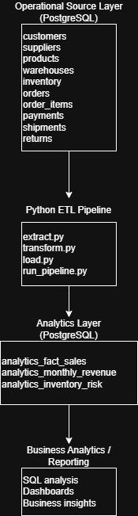
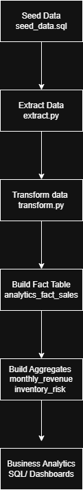

# Enterprise Operations Data Platform

## Overview

This project implements a simplified enterprise data platform that simulates how operational business data is transformed into analytics-ready datasets.

The system models transactional data across customers, products, suppliers, warehouses, inventory, orders, payments, shipments, and returns. A Python-based ETL pipeline extracts this operational data from PostgreSQL tables, transforms it into structured analytics datasets, and loads the results into dedicated reporting tables.

The platform demonstrates key data engineering and analytics engineering concepts including relational data modelling, ETL pipeline development, analytics table design, and SQL-based business analysis.

---

## Business Problem

Organizations often store operational data across multiple transactional systems. While this data captures important business activity, it is not structured for analytics or reporting.

Without a centralized analytics layer, it becomes difficult to answer critical business questions such as:

- How much revenue is generated each month?
- Which products generate the most sales?
- Which customers contribute the most revenue?
- Which warehouses are at risk of stock shortages?
- How do returns and shipments affect operational performance?

This project builds a small-scale enterprise data platform that transforms raw operational data into analytics-ready datasets that support business insights and reporting.

---

## System Architecture

The platform follows a layered data architecture:

1. **Operational Source Layer** – PostgreSQL transactional tables  
2. **Data Processing Layer** – Python ETL pipeline  
3. **Analytics Layer** – transformed reporting tables  
4. **Business Intelligence Layer** – SQL queries and dashboards  



---
## Pipeline Orchestration

The ETL workflow is orchestrated using a DAG structure, enabling scheduled execution and clear dependency management between pipeline stages.

*Workflow*:

Extract → Transform → Load


---
## Pipeline Workflow

The ETL pipeline processes operational data through a structured workflow.



---
## Data Model

The operational schema includes the following core entities:

- customers  
- suppliers  
- products  
- warehouses  
- inventory  
- orders  
- order_items  
- payments  
- shipments  
- returns  

These tables capture transactional business activity and are used as inputs for the ETL pipeline.

Entity relationships and schema design are documented in: docs/data_model.md


---

## ETL Pipeline

The ETL pipeline is implemented in Python and consists of modular components.

pipeline/
│
├ extract.py
├ transform.py
├ load.py
└ run_pipeline.py


### Extract

The extract module reads source tables from PostgreSQL.

### Transform

The transform module processes raw transactional data and generates analytics datasets including:

- sales fact tables
- monthly revenue aggregates
- inventory risk indicators

### Load

The load module writes transformed datasets back into PostgreSQL analytics tables.

### Pipeline Execution

The full pipeline is executed using:

``python pipeline/run_pipeline.py``

Example pipeline output:
Extracted customers: 1000 rows
Extracted suppliers: 50 rows
Extracted products: 500 rows
Extracted warehouses: 10 rows
Extracted inventory: 1500 rows
Extracted orders: 3000 rows
Extracted order_items: 9000 rows
Extracted payments: 2500 rows
Extracted shipments: 2500 rows
Extracted returns: 400 rows
Transformed fact_sales: 9000 rows
Transformed monthly_revenue: 7 rows
Transformed inventory_risk: 42 rows
Loaded analytics_fact_sales: 9000 rows
Loaded analytics_monthly_revenue: 7 rows
Loaded analytics_inventory_risk: 42 rows
Pipeline completed successfully.

## Analytics Layer

The ETL pipeline produces analytics-ready tables designed for reporting.

**analytics_fact_sales**

Sales fact table with one row per order item.

Supports:

- product sales analysis
- revenue calculations
- customer purchasing behaviour

**analytics_monthly_revenue**

Aggregated monthly revenue dataset used for trend analysis and business reporting.

**analytics_inventory_risk**

Identifies products with potential stock shortages across warehouses.

## Business Analytics

Business insights can be generated using SQL queries located in:

`sql/analytics/business_analytics.sql`

### Example analysis includes:

*   Monthly revenue trends
*   Top selling products
*   Revenue by customer segment
*   Inventory risk detection
*   Return rate analysis
```
enterprise-operations-data-platform
│
├── docs
│   ├── architecture.md
│   ├── business_problem.md
│   ├── data_model.md
│   ├── erd.png
│   └── architecture_diagram.png
│
├── pipeline
│   ├── extract.py
│   ├── transform.py
│   ├── load.py
│   └── run_pipeline.py
│
├── sql
│   ├── ddl
│   │   ├── 01_customers.sql
│   │   ├── 02_suppliers.sql
│   │   ├── 03_products.sql
│   │   ├── 04_warehouses.sql
│   │   ├── 05_inventory.sql
│   │   ├── 06_orders.sql
│   │   ├── 07_order_items.sql
│   │   ├── 08_payments.sql
│   │   ├── 09_shipments.sql
│   │   └── 10_returns.sql
│   │
│   ├── seed_data.sql
│   ├── insertion_check.sql
│   │
│   └── analytics
│       └── business_analytics.sql
│
├── data_dump.sql
├── README.md
├── .gitignore
└── LICENSE
```
## Technology Stack

### Database
- PostgreSQL

### Programming
- Python
- Pandas

### Data Processing
- SQL
- ETL pipelines

### Tools
- DBeaver
- Git / GitHub

### Visualization 
- Power BI / Tableau

---

## How to Run the Project

### 1. Create database tables

Execute SQL scripts inside: ``sql/ddl/``
---

### 2. Load synthetic data

Run: ``sql/seed_data.sql``

---

### 3. Validate data loading

Execute:``sql/insertion_check.sql``

---

### 4. Run the ETL pipeline
``python pipeline/run_pipeline.py``

---

### 5. Run business analytics queries

Execute:``sql/analytics/business_analytics.sql``


---

## Key Outcomes

This project demonstrates:

- relational schema design for operational systems
- synthetic enterprise data generation
- Python-based ETL pipeline development
- analytics-ready data modelling
- SQL-based business analytics
- end-to-end data platform architecture