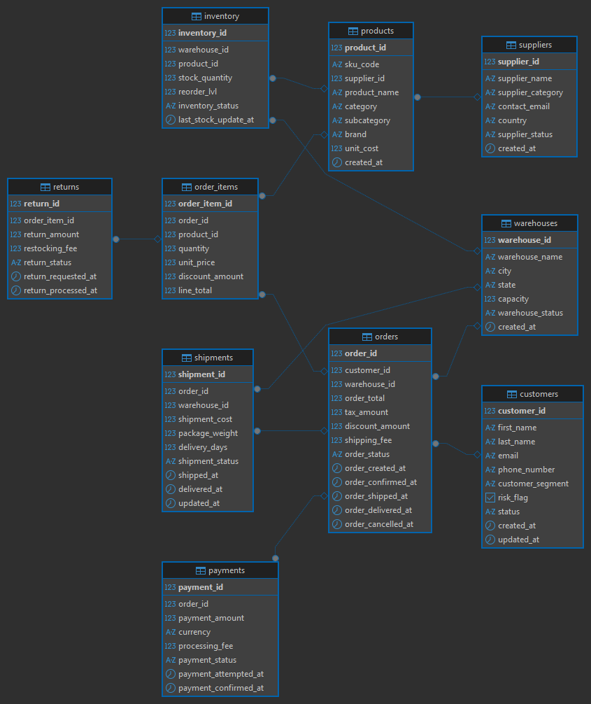

# Data Model

## Overview

The data model represents a simplified enterprise operations system containing customers, suppliers, products, warehouses, inventory, orders, payments, shipments, and returns.

The schema is designed to simulate real-world transactional systems where operational data is captured across multiple related entities. These source tables act as the foundation for building analytics-ready datasets through an ETL pipeline.

The data model consists of two main layers:

- **Operational Source Layer** – normalized transactional tables
- **Analytics Layer** – transformed tables designed for reporting and analysis

---

## Entity Relationship Diagram

---

## Operational Source Tables

The following tables represent operational business systems.

## customers
Stores customer profile information.

Key fields include:

- `customer_id`
- `first_name`
- `last_name`
- `email`
- `phone_number`
- `customer_segment`
- `status`
- `risk_flag`
- `created_at`
- `updated_at`

Each customer may place multiple orders.

---

## suppliers
Represents companies supplying products to the business.

Key fields include:

- `supplier_id`
- `supplier_name`
- `supplier_category`
- `supplier_status`
- `contact_email`
- `country`
- `created_at`

A supplier can provide many products.

---

## products
Contains product master data.

Key fields include:

- `product_id`
- `product_name`
- `supplier_id`
- `category`
- `unit_price`
- `product_status`
- `created_at`

Each product belongs to one supplier.

---

## warehouses
Represents warehouse locations storing inventory.

Key fields include:

- `warehouse_id`
- `warehouse_name`
- `city`
- `country`
- `capacity`
- `created_at`

A warehouse stores multiple products.

---

## inventory
Tracks product stock levels at warehouses.

Key fields include:

- `inventory_id`
- `product_id`
- `warehouse_id`
- `stock_quantity`
- `last_updated`

Each record represents a product's stock level at a specific warehouse.

---

## orders
Represents sales orders placed by customers.

Key fields include:

- `order_id`
- `customer_id`
- `order_date`
- `order_status`
- `warehouse_id`
- `total_amount`

A customer can place multiple orders.

---

## order_items
Contains line-level order details.

Key fields include:

- `order_item_id`
- `order_id`
- `product_id`
- `quantity`
- `unit_price`
- `line_total`

Each order can contain multiple order items.

---

## payments
Stores payment transactions associated with orders.

Key fields include:

- `payment_id`
- `order_id`
- `payment_method`
- `payment_status`
- `payment_date`
- `amount`

Each order may have one payment record.

---

## shipments
Represents shipment activity for orders.

Key fields include:

- `shipment_id`
- `order_id`
- `shipment_date`
- `delivery_date`
- `shipment_status`
- `carrier`

Each order may have an associated shipment.

---

## returns
Tracks returned products.

Key fields include:

- `return_id`
- `order_item_id`
- `return_date`
- `return_reason`
- `return_quantity`

Returns are linked to individual order items.

---

## Table Relationships

Key relationships in the model include:

- One **customer** can place many **orders**
- One **order** can contain many **order_items**
- Each **order_item** references one **product**
- One **supplier** can supply many **products**
- One **product** can exist in multiple **inventory** records across warehouses
- Each **order** may have one **payment** and one **shipment**
- Returns are linked to individual **order_items**

These relationships allow the system to track sales transactions from customer order through payment, shipment, and potential return.

---

## Analytics Layer

The ETL pipeline transforms operational data into analytics-ready tables.

## analytics_fact_sales

This is the primary sales fact table used for reporting.

Grain:
**one row per order item**

Typical fields include:

- order_id
- customer_id
- product_id
- warehouse_id
- quantity
- unit_price
- revenue
- order_date

This table is designed for revenue analysis, product performance tracking, and customer behaviour insights.

---

## analytics_monthly_revenue

Aggregated revenue by month.

Grain:
**one row per month**

Typical fields include:

- month
- total_orders
- total_revenue

This dataset is used for tracking sales trends and business growth over time.

---

## analytics_inventory_risk

Identifies products at risk of low stock.

Grain:
**one row per product per warehouse where stock risk exists**

Typical fields include:

- product_id
- warehouse_id
- stock_quantity
- risk_flag

This table supports operational monitoring and supply chain decision-making.

---

## Data Flow Summary

Operational source tables store raw transactional data generated by business processes.

The Python ETL pipeline extracts this data, performs transformations to structure it for analytics, and loads the results into dedicated reporting tables.

These analytics tables support business insights such as revenue analysis, product performance monitoring, and inventory risk detection.

